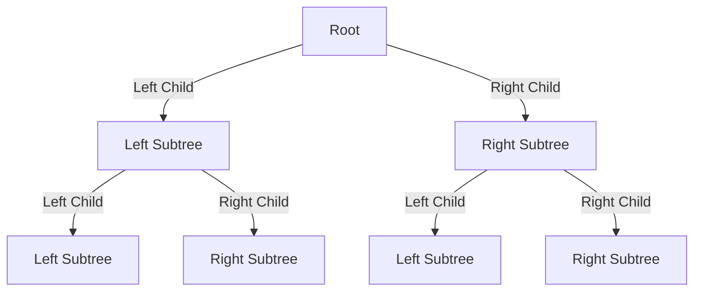

# balanced-bst-javascript

Simple balanced binary search tree written in JavaScript.

## Visualization of binary search tree

```mermaid
graph TD
    A[Root] -->|Left Child| B[Left Subtree]
    A -->|Right Child| C[Right Subtree]
    B -->|Left Child| D[Left Subtree]
    B -->|Right Child| E[Right Subtree]
    C -->|Left Child| F[Left Subtree]
    C -->|Right Child| G[Right Subtree]
```
